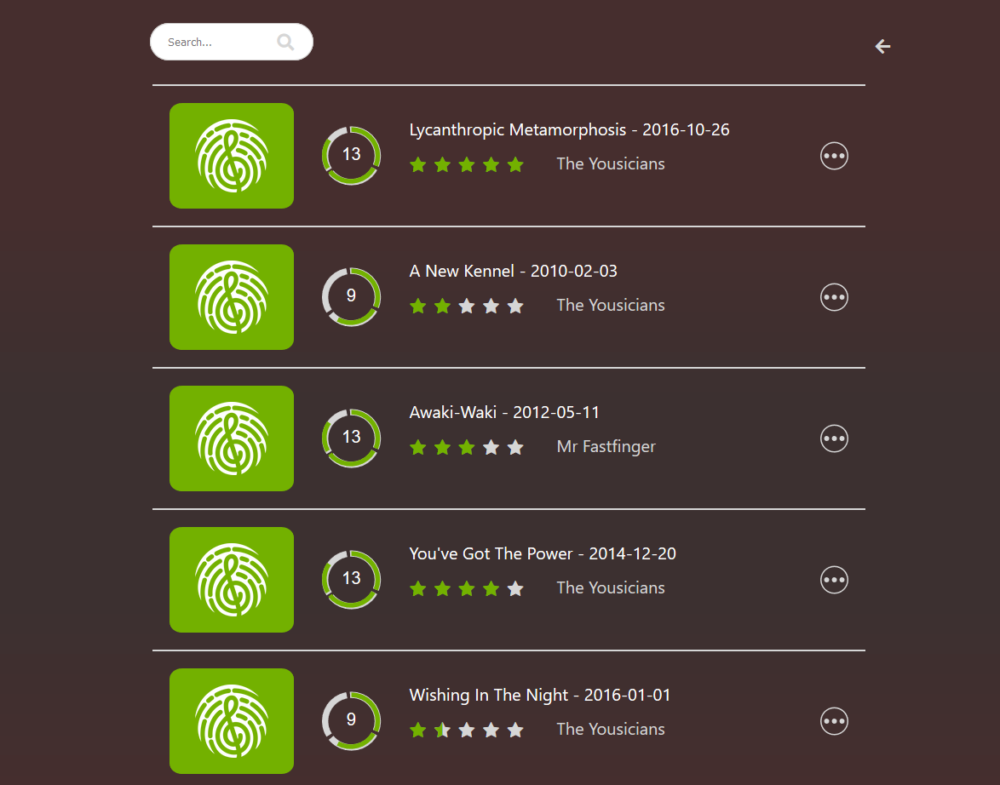

# A Spotify-alike Song List design

## Introduction
A Song List design with filters.

### `npm install`

Install the independencies.

### `npm start`

Runs the app in the development mode.
Open [http://localhost:3000](http://localhost:3000) to view it in the browser.

# Note:
- the program is created with create-react-app.
- by running the commands above, the program is executed. This app is also designed to fit various devices such as tablet and mobile.
- rating, sort by title name and level filter are available.
- To be specific, at the top, in the left is the input for title search and in the right is the arrow lead to the filter level bar. There are 2 adjustable sliders in each end of the bar. The area in the middle of the bar (green part) are the level range that is filtered. For example, slider values of 3 and 12 will filter all songs that are larger than or equal to 3 and less than or equal to 12.
- infinite scroll is made by duplicate the data once scrolled to the end.

